***-  
 Vue.js
 ***

# 什么是 Vue.js?

Vue（发音为/vjuː/，like view）是构建用户界面的渐进框架。 与其他整体框架不同，Vue是从根本上设计的，以便逐步采用。 核心图书馆仅专注于视图层，并且很容易与其他图书馆或现有项目相提并论。 另一方面，当与现代工具和支持库一起使用时，Vue也能完美地为先进的单页面应用程序提供支持。
如果您是一名经验丰富的前端开发人员，并想知道Vue如何与其他库/框架进行比较，请查看“与其他框架的比较”。

# 入门
官方指南介绍了HTML，CSS和JavaScript的中级知识。 如果你是一个全新的前沿发展，可能不是最好的想法，直接进入一个框架作为你的第一步 - 掌握基础，然后回来！ 以前的经验与其他框架有所帮助，但不是必需的。

尝试Vue.js的最简单方法是使用JSFiddle Hello World示例。 随意打开它在另一个选项卡，并沿着我们通过一些基本的例子。 或者，您可以简单地创建一个index.html文件，并包含Vue：
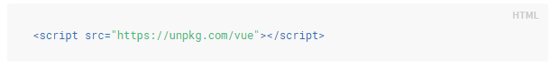

安装页面提供了更多安装Vue的选项。 请注意，我们不建议初学者从vue-cli开始，特别是如果您还不熟悉基于Node.js的构建工具。
# 声明性渲染
Vue.js的核心是使我们能够使用简单的模板语法向DOM声明性地呈现数据的系统：

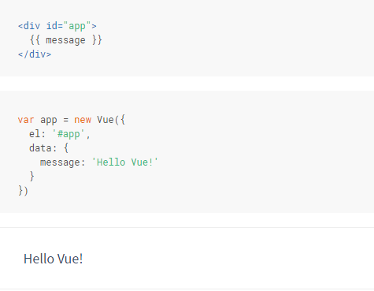

我们已经创建了我们第一个Vue应用程序！ 这看起来与渲染字符串模板非常相似，但是Vue在引擎盖下做了很多工作。 数据和DOM现在已经链接起来了，现在所有的内容都被反应了。 我们怎么知道？ 只需打开浏览器的JavaScript控制台（现在，在此页面上），并将app.message设置为不同的值。 您应该看到上面渲染的示例相应更新。
除了文本插值，我们还可以绑定这样的元素属性：

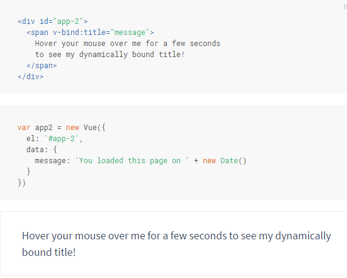

在这里，我们遇到了一些新的东西。 你看到的v-bind属性被称为一个指令。 伪指令以V-为前缀，表示它们是由Vue提供的特殊属性，并且您可能已经猜到，它们对渲染的DOM应用特殊的反应行为。 这里基本上是说“使用Vue实例上的message属性来保持这个元素的title属性是最新的。”
如果您再次打开JavaScript控制台并输入app2.message = 'some new message'，您将再次看到绑定的HTML（在这种情况下是标题属性）已被更新。

# 条件和循环
切换元素的存在也很简单：

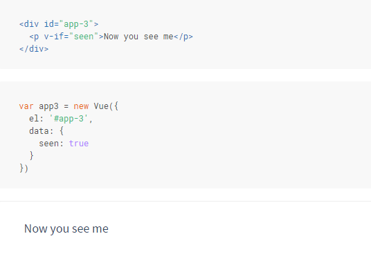

继续，在控制台中输入app3.seen = false。 你应该看到消息消失了。
这个例子表明我们可以将数据绑定到不仅文本和属性，还可以绑定DOM的结构。 此外，Vue还提供了一个强大的过渡效果系统，可以通过Vue插入/更新/删除元素时自动应用转换效果。
还有很多其他指令，每个都有自己的特殊功能。 例如，v-for指令可用于使用数组中的数据显示项目列表：

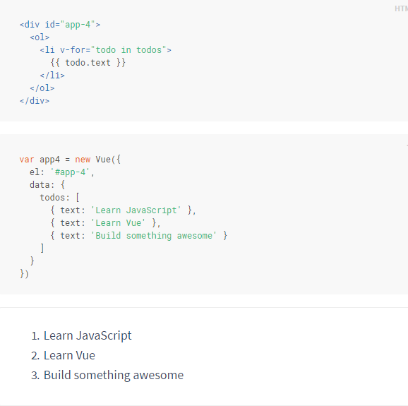

在控制台中，输入app4.todos.push（{text：'New item'}）。 您应该看到一个新的项目附加到列表。

# 处理用户输入
为了让用户与您的应用程序进行交互，我们可以使用v-on指令附加调用Vue实例上的方法的事件侦听器：

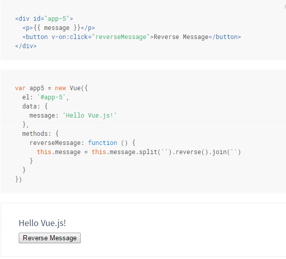
s
注意在方法中，我们只是在不触摸DOM的情况下更新我们的应用程序的状态 - 所有的DOM操作都由Vue处理，您编写的代码集中在底层逻辑上。
Vue还提供了v-model指令，可以在表单输入和应用状态之间进行双向绑定：

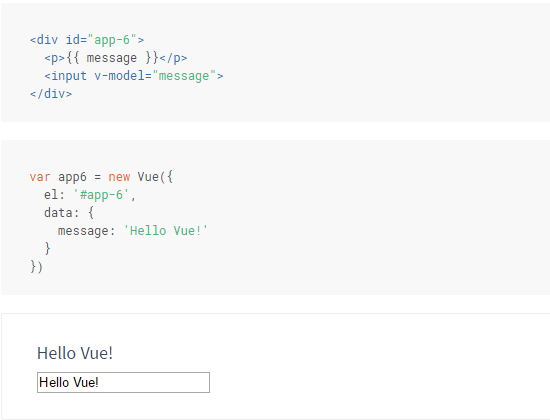

# 组成部分
组件系统是Vue中另一个重要的概念，因为它是一种抽象，它允许我们构建由小的，独立的，经常可重复使用的组件组成的大规模应用程序。 如果我们考虑一下，几乎任何类型的应用程序界面都可以被抽象成一个组件树：

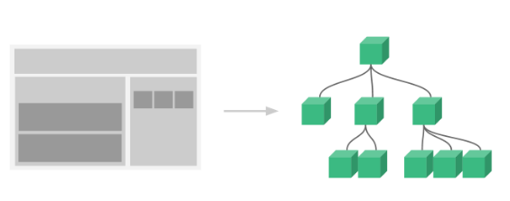

在Vue中，组件本质上是具有预定义选项的Vue实例。 在Vue中注册组件是直接的：

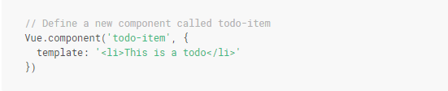

现在您可以在另一个组件的模板中进行组合：

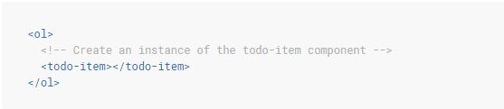

但是，这样做会给每个任务带来相同的文本，这不是超级有趣。 我们应该能够将数据从父范围传递给子组件。 我们修改组件定义，使其接受一个道具：

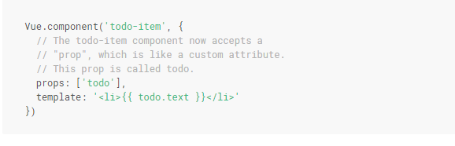

现在我们可以使用v-bind将每个重复的组件传递给：

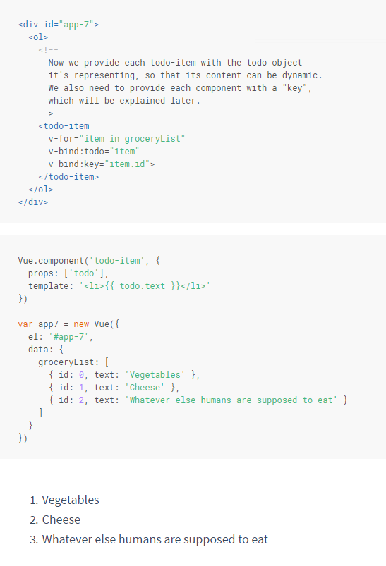

这只是个例子，但是我们已经设法将我们的应用程序分成两个较小的单元，并且孩子通过道具界面与父母相当好地解耦。 我们现在可以通过更复杂的模板和逻辑来进一步改进我们的<todo-item>组件，而不会影响父应用程序。
在大型应用中，有必要将整个应用程序分成组件，使开发变得易于管理。 我们将在本指南中稍后详细介绍组件，但这里是一个（虚构的）示例，其中应用程序的模板可能与组件类似：

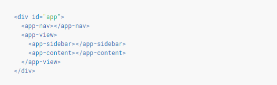

# 与自定义元素的关系

您可能已经注意到Vue组件非常类似于自定义元素，它们是Web Components Spec的一部分。 这是因为Vue的组件语法在规范之后被松散地建模。 例如，Vue组件实现Slot API，这是特殊属性。 但是，有一些关键的区别：

1.Web Components Spec仍处于草稿状态，并且不是在每个浏览器中本地实现的。 相比之下，Vue组件不需要任何聚合物填充，并在所有支持的浏览器（IE9及更高版本）中始终如一地工作。 需要时，Vue组件也可以包含在本地自定义元素中。

2.Vue组件提供了在普通自定义元素中不可用的重要功能，特别是跨组件数据流，自定义事件通信和构建工具集成。

# 构造函数
通过使用Vue构造函数创建一个根Vue实例来引导每个Vue vm：

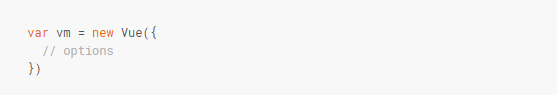

尽管与MVVM模式没有严格的关联，Vue的设计也受到了部分启发。 作为惯例，我们经常使用变量vm（ViewModel的简称）来引用我们的Vue实例。
当您实例化Vue实例时，您需要传递一个选项对象，该对象可以包含数据，模板，要挂载的元素，方法，生命周期回调等选项。 选项的完整列表可以在API参考中找到。
可以扩展Vue构造函数，以创建具有预定义选项的可重用组件构造函数：

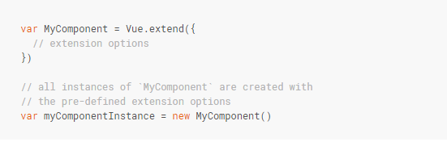

虽然可以强制创建扩展实例，但大多数时候建议在模板中以自定义元素声明性地组合它们。 稍后将详细介绍组件系统。 现在，您只需要知道所有Vue组件基本上是扩展的Vue实例。

# 属性和方法

每个Vue实例代理在其数据对象中找到的所有属性：

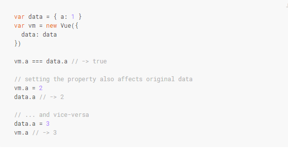

应该注意，只有这些代理性质是反应性的。 如果在实例创建后附加一个新属性，它将不会触发任何视图更新。 稍后将详细讨论反应体系。
除数据属性之外，Vue实例还暴露了一些有用的实例属性和方法。 这些属性和方法前缀为$，以区别于代理的数据属性。 例如：

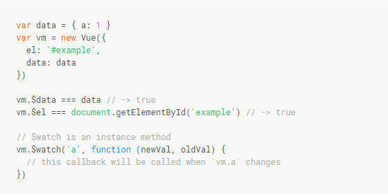

不要在实例属性或回调上使用箭头函数（例如vm.$ watch（'a'，newVal => this.myMethod（）））。 由于箭头函数绑定到父上下文，这不会像您所期望的那样是Vue实例，并且this.myMethod将不被定义。

有关实例属性和方法的完整列表，请参阅API参考。

# 实例生命周期挂钩

每个Vue实例在创建时都会经历一系列初始化步骤 - 例如，需要设置数据观察，编译模板，将实例装载到DOM，并在数据更改时更新DOM。 一路上，它还将调用一些生命周期钩子，这使我们有机会执行自定义逻辑。 例如，在创建实例后调用创建的钩子：

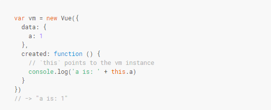

还有其他钩子将在实例的生命周期的不同阶段被调用，例如挂载，更新和销毁。 调用所有生命周期钩子，其上下文指向调用它的Vue实例。 你可能想知道“控制器”的概念在Vue世界中的位置，答案是：没有控制器。 您的组件的自定义逻辑将在这些生命周期钩子之间拆分。
 
# 生命周期图
以下是实例生命周期的图表。 您不需要完全了解所有正在进行的事情，但这个图表将来将会有所帮助。

